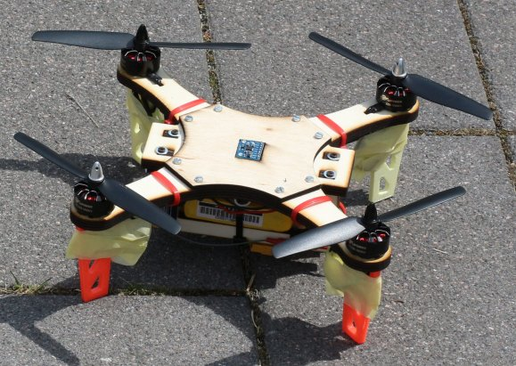
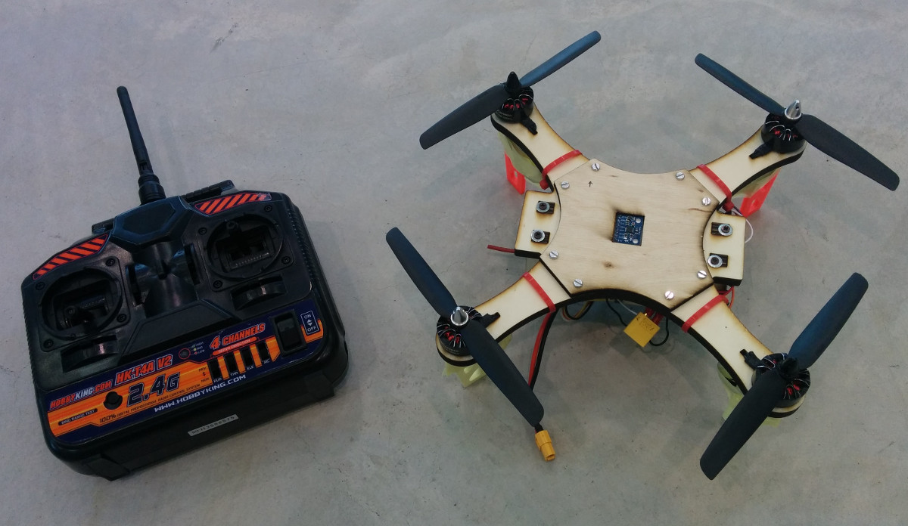
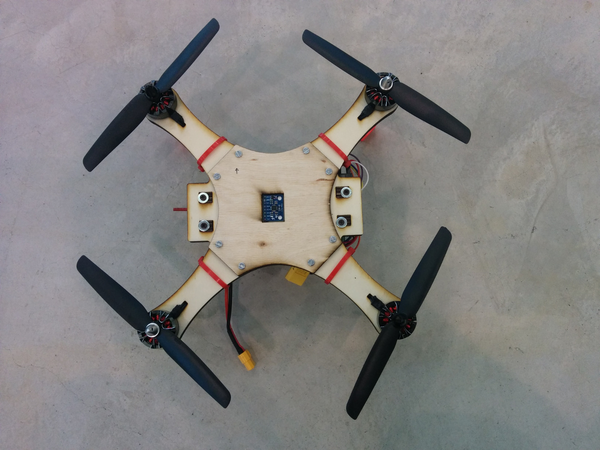
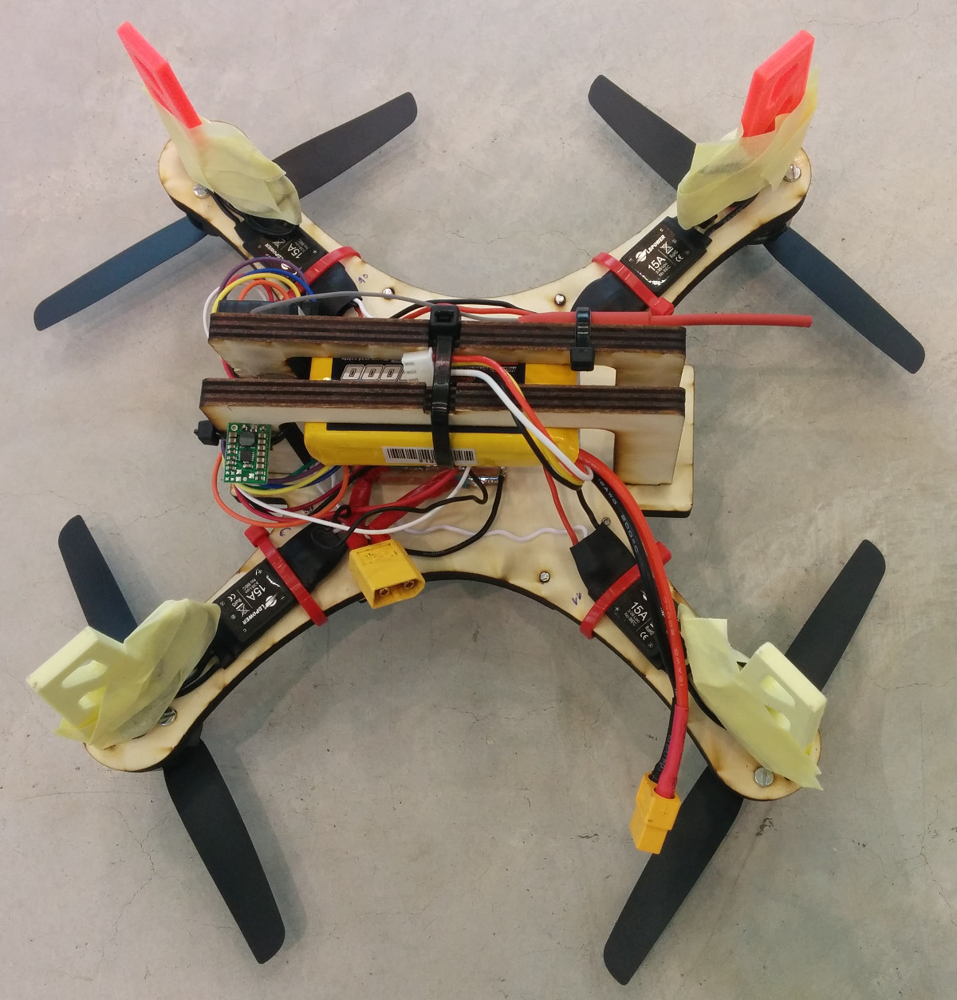
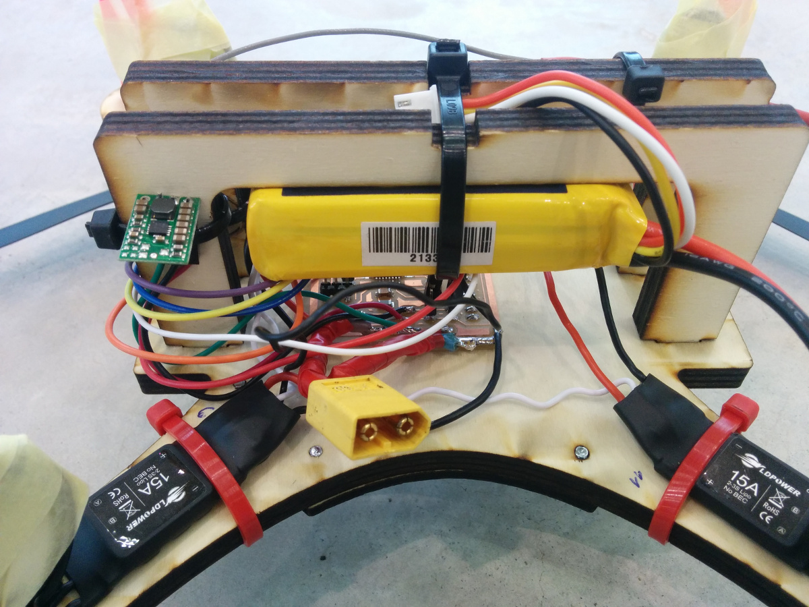
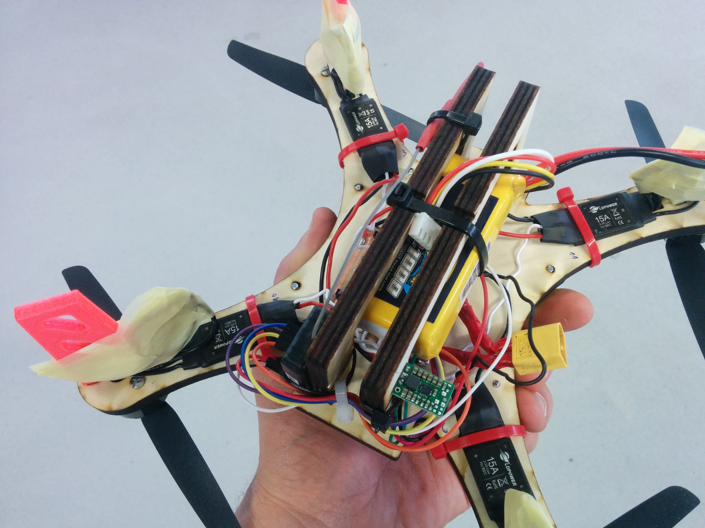
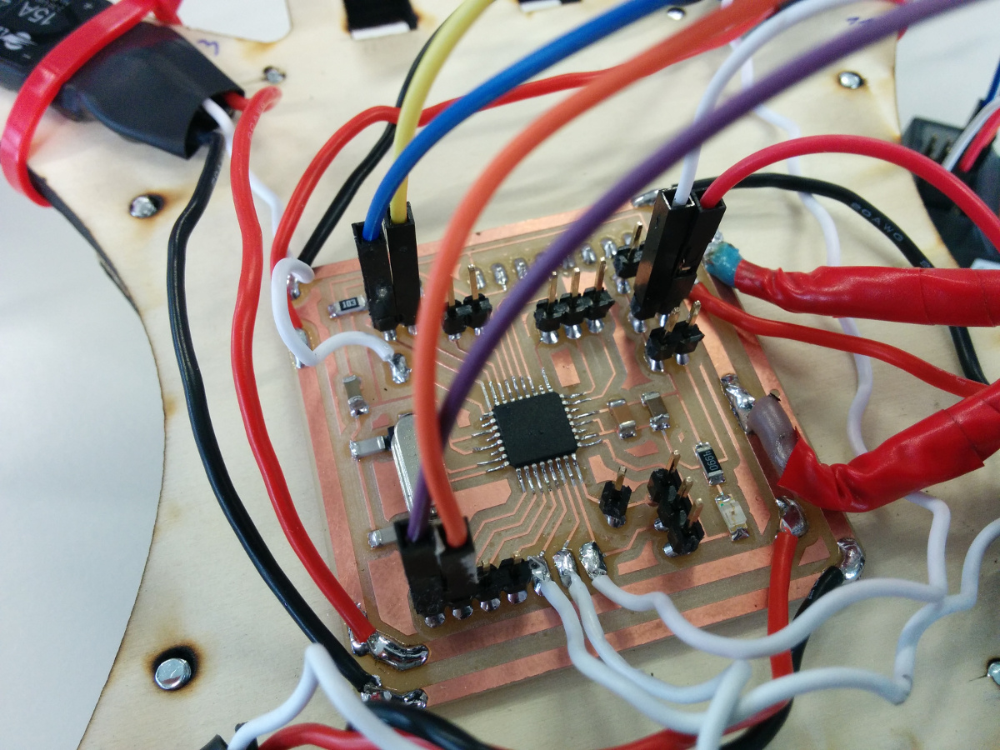
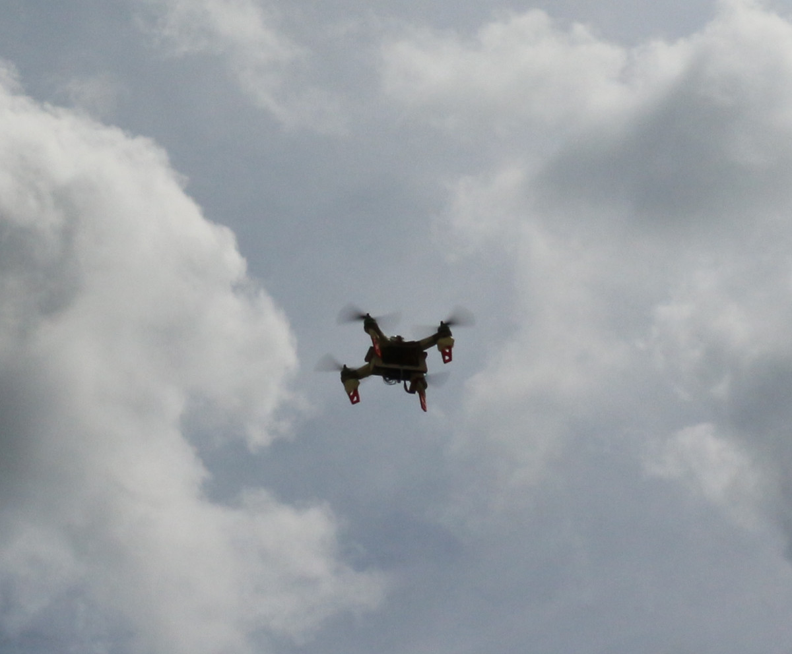

<h1 style="font-family: courier;" align="center">satshacopter 250X</h1>

<i>An open source, low cost and fabbable quad X drone.</i>

  

satshacopter 250X
--

satshacopter 250X is a quadcopter built around the [satshakit flight controller](https://github.com/satshakit/satshakit-flight-controller). It is designed to be as  simple and cheap as possible, and to be easily made inside any Fab Lab.

250X specifications:

- 250mm wooden frame and supports
- open source flight controller
- MPU6050 IMU located exactly at the center
- 4 x 2200Kv brushless motors
- 4 x 15A ESCs
- MultiWii compatible
- 4 channel Hobby King remote and receiver
- costs under 100€

Downloads
--

- [satshakit flight controller eagle board]()
- [satshakit flight controller eagle sch]()
- [satshakit flight controller internal traces png]()
- [satshakit flight controller holes png]()
- [satshakit flight controller cut png]()

- [main frame and supports Rhino]()
- [main frame and supports dxf]()
- [upper frame and supports Rhino]()
- [upper frame and supports dxf]()
- [foot stl]()
- [foot Rhino]()
- [satshacopter 250X BOM Excel]()
- [satshacopter 250X BOM Open document]()

Media
--

Some images of a built satshacopter 250X

satshacopter 250X perfomance test:

